# Flowchart OCR KTP dengan Gemini Flash

## 1. Flowchart Utama Aplikasi

```mermaid
flowchart TD
    A[🏠 User Buka Aplikasi] --> B[📄 Halaman Upload KTP]
    B --> C{User Upload Gambar?}
    C -->|Tidak| B
    C -->|Ya| D[🖼️ Validasi File]
    
    D --> E{Format Valid?<br/>JPG/PNG/WebP}
    E -->|Tidak| F[❌ Error: Format Salah]
    F --> B
    
    E -->|Ya| G{Ukuran ≤ 5MB?}
    G -->|Tidak| H[❌ Error: File Terlalu Besar]
    H --> B
    
    G -->|Ya| I[✅ Tampilkan Preview]
    I --> J{User Klik Ekstrak?}
    J -->|Tidak| K{User Klik Reset?}
    K -->|Ya| B
    K -->|Tidak| J
    
    J -->|Ya| L[⏳ Loading: Proses OCR]
    L --> M[🤖 Kirim ke Gemini API]
    M --> N{Response OK?}
    
    N -->|Error| O[❌ Error Popup]
    O --> B
    
    N -->|OK| P{Gambar adalah KTP?}
    P -->|Tidak| Q[❌ Error: Bukan KTP]
    Q --> B
    
    P -->|Ya| R[✅ Tampilkan Hasil Ekstraksi]
    R --> S{User Action?}
    
    S -->|Salin JSON| T[📋 Copy ke Clipboard]
    T --> S
    
    S -->|Download| U[💾 Download JSON File]
    U --> S
    
    S -->|Upload Baru| B
```

## 2. Flowchart Backend API

```mermaid
flowchart TD
    A[📥 POST /api/extract-ktp] --> B[Multer Middleware]
    B --> C{File Ada?}
    
    C -->|Tidak| D[400: No File Uploaded]
    C -->|Ya| E{MIME Type Valid?}
    
    E -->|Tidak| F[400: Invalid File Type]
    E -->|Ya| G{Size ≤ 5MB?}
    
    G -->|Tidak| H[400: File Too Large]
    G -->|Ya| I[Process Image dengan Sharp]
    
    I --> J{Process OK?}
    J -->|Error| K[500: Failed to Process]
    
    J -->|OK| L[Kirim ke Gemini Flash API]
    L --> M{API Response OK?}
    
    M -->|Error| N{Jenis Error?}
    N -->|API Key Invalid| O[500: Invalid API Key]
    N -->|Network Error| P[500: Connection Failed]
    N -->|Other| Q[500: Processing Failed]
    
    M -->|OK| R[Parse JSON Response]
    R --> S{Parse OK?}
    
    S -->|Error| T[500: Failed to Parse]
    S -->|OK| U{is_ktp = true?}
    
    U -->|Tidak| V[200: success=false, Bukan KTP]
    U -->|Ya| W[200: success=true, Data KTP]
```

## 3. Flowchart Gemini AI Processing

```mermaid
flowchart TD
    A[🖼️ Terima Image Buffer] --> B[Convert ke Base64]
    B --> C[Siapkan Prompt OCR KTP]
    C --> D[Kirim ke Gemini 2.0 Flash]
    
    D --> E{Gemini Analisis}
    E --> F{Apakah Gambar KTP?}
    
    F -->|Tidak| G[Return: is_ktp = false]
    G --> H[Sertakan Error Message]
    
    F -->|Ya| I[Ekstrak Data KTP]
    I --> J[NIK]
    I --> K[Nama]
    I --> L[Tempat/Tgl Lahir]
    I --> M[Jenis Kelamin]
    I --> N[Alamat Lengkap]
    I --> O[RT/RW]
    I --> P[Kelurahan]
    I --> Q[Kecamatan]
    I --> R[Kabupaten/Kota]
    I --> S[Provinsi]
    I --> T[Agama]
    I --> U[Status Perkawinan]
    I --> V[Pekerjaan]
    I --> W[Kewarganegaraan]
    I --> X[Berlaku Hingga]
    
    J & K & L & M & N & O & P & Q & R & S & T & U & V & W & X --> Y[Gabung ke JSON]
    Y --> Z[Return: is_ktp = true + Data]
```

## 4. Flowchart User Interaction (Frontend)

## 5. Sequence Diagram

```mermaid
sequenceDiagram
    participant U as 👤 User
    participant F as 🌐 Frontend
    participant B as ⚙️ Backend
    participant G as 🤖 Gemini API
    
    U->>F: Upload Foto KTP
    F->>F: Validasi Format & Ukuran
    
    alt File Invalid
        F-->>U: ❌ Error Popup
    else File Valid
        F->>F: Tampilkan Preview
        U->>F: Klik "Ekstrak Data"
        F->>F: Tampilkan Loading
        F->>B: POST /api/extract-ktp
        
        B->>B: Validasi File
        B->>B: Process Image (Sharp)
        B->>G: Kirim Gambar + Prompt
        
        G->>G: Analisis Gambar
        
        alt Bukan KTP
            G-->>B: {is_ktp: false}
            B-->>F: {success: false}
            F-->>U: ❌ Error: Bukan KTP
        else KTP Valid
            G-->>B: {is_ktp: true, data: {...}}
            B-->>F: {success: true, data: {...}}
            F-->>U: ✅ Tampilkan Hasil
        end
    end
    
    opt User Actions
        U->>F: Klik "Salin JSON"
        F-->>U: ✅ JSON Copied
        
        U->>F: Klik "Download"
        F-->>U: 💾 Download File
    end
```

## 6. State Diagram

## 7. Component Diagram

```mermaid
flowchart TB
    subgraph Frontend["🌐 Frontend (public/index.html)"]
        UI[Tailwind CSS UI]
        DropZone[Drop Zone Component]
        Preview[Image Preview]
        Results[Results Display]
        Modal[Error Modal Popup]
    end
    
    subgraph Backend["⚙️ Backend (Node.js + Express)"]
        Routes[ktpRoutes.js]
        Middleware[upload.js - Multer]
        Service[geminiService.js]
        Utils[imageUtils.js - Sharp]
    end
    
    subgraph External["☁️ External"]
        Gemini[Google Gemini 2.0 Flash API]
    end
    
    UI --> DropZone
    DropZone --> Preview
    Preview --> Routes
    Routes --> Middleware
    Middleware --> Utils
    Utils --> Service
    Service --> Gemini
    Gemini --> Service
    Service --> Routes
    Routes --> Results
    Routes --> Modal
```

---

## Cara Melihat Diagram

Untuk melihat diagram Mermaid:

1. **VS Code** - Install extension "Markdown Preview Mermaid Support"
2. **GitHub** - Upload file ini, GitHub otomatis render Mermaid
3. **Online** - Buka https://mermaid.live dan paste kode diagram

---

*Generated for OCR KTP Gemini Flash Project*
